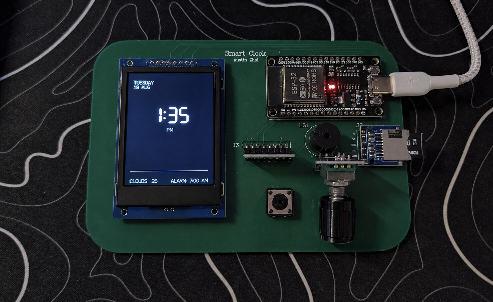
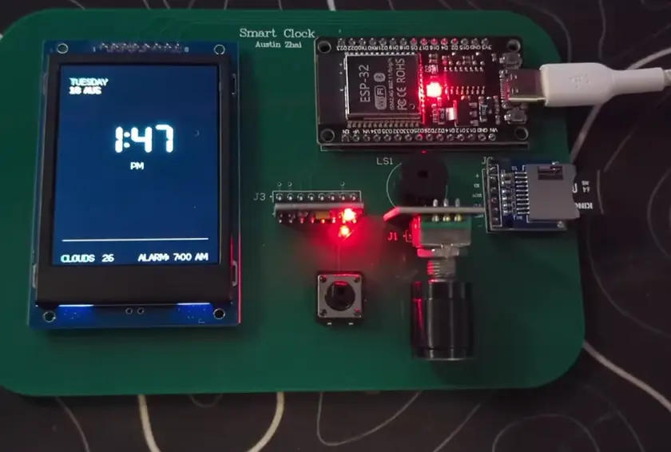
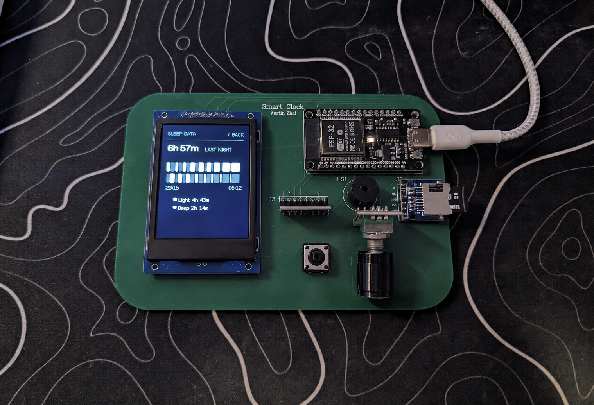
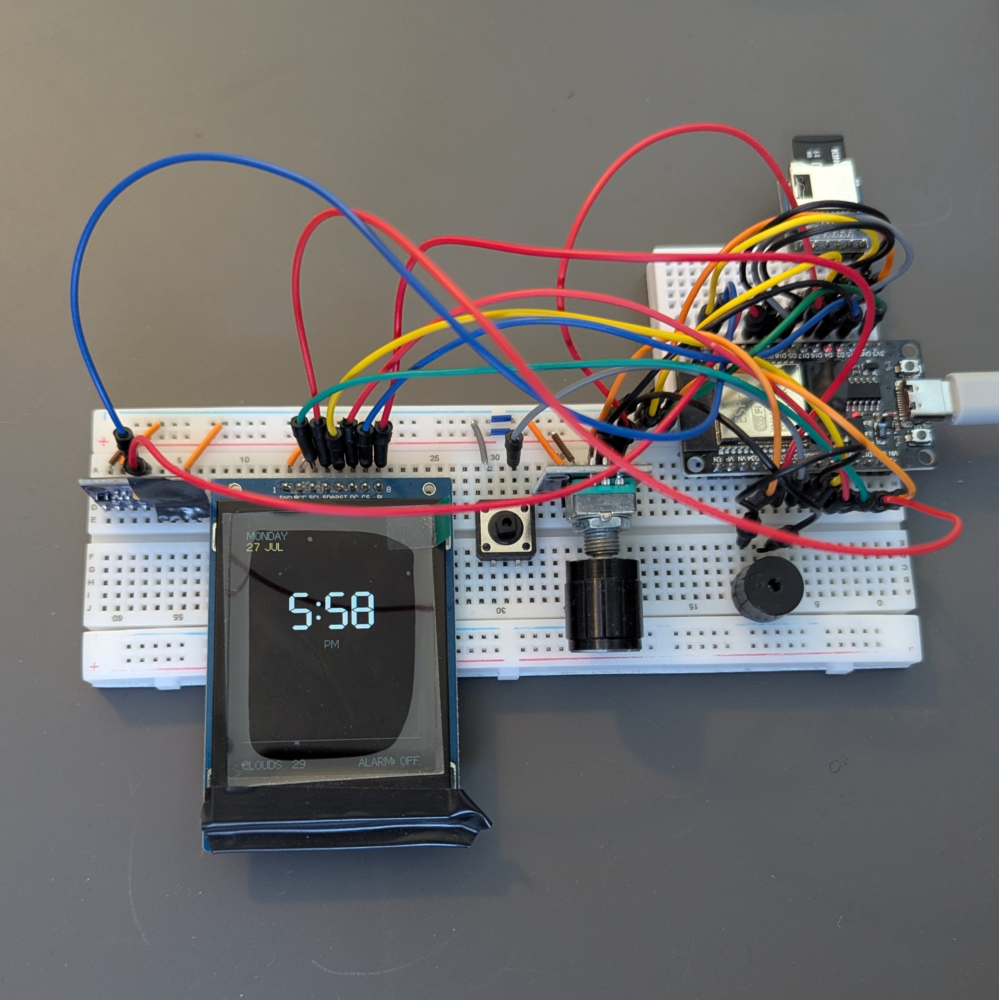
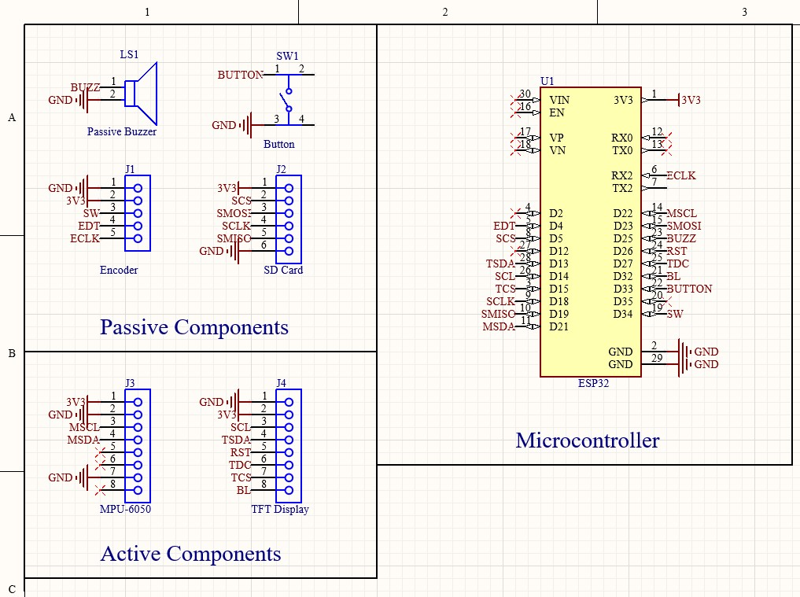
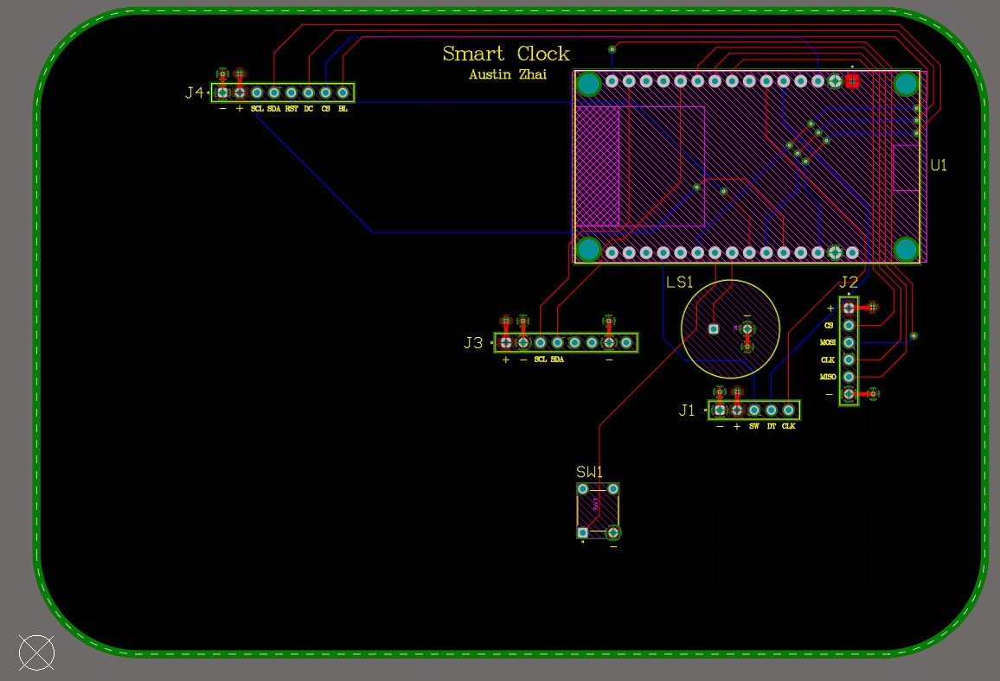
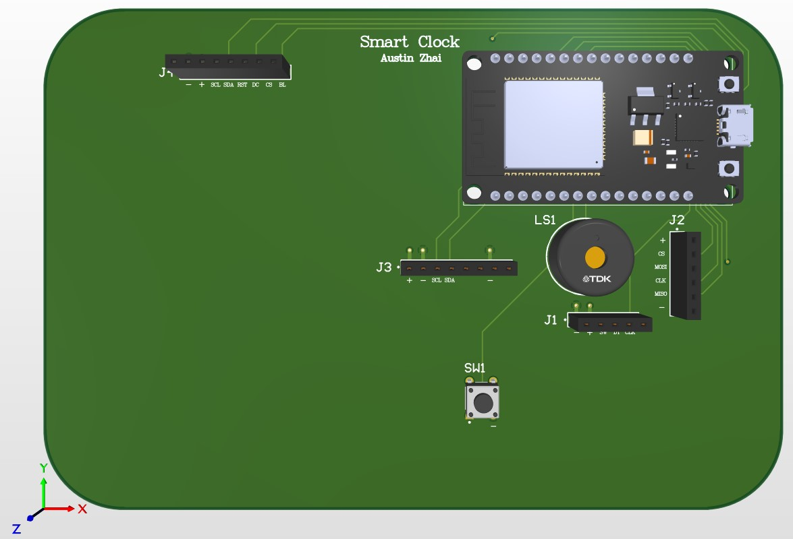

<h1 align="center">Smart Alarm</h1>

<p align="center">
  An ESP32 alarm clock that tracks your sleep with an onboard accelerometer<br>
  and wakes you during <em>light</em> sleep, so you can lock in during the day.
</p>

<p align="center">
  
  
  
  
  
</p>

<p align="center">
  
</p>

<p align="center"><sub>The finished board. Home screen: NTP time, date, live weather, and alarm status, all flicker-free.</sub></p>

---

## What it is

A bedside clock I designed end to end: firmware, sleep-staging model, schematic, and PCB.

You clip the accelerometer to your mattress, hit **Enter Sleep Mode**, and the device logs
motion all night at 2 Hz to an SD card. Every 30 seconds it scores that window as **light** or
**deep** sleep. In the morning it doesn't just ring at 6:30. It watches for the first moment
you're in light sleep inside a window you choose, and rings *then*.

Everything runs on the ESP32 itself. No phone, no cloud, no app.

**Contents:** [Demo](#demo) · [Features](#features) · [Sleep tracking](#sleep-tracking) · [The ML story](#the-ml-story-and-why-the-forest-didnt-win) · [Smart wake](#smart-wake) · [Breadboard → board](#from-breadboard-to-board) · [Hardware](#hardware) · [Build it](#building--flashing)

---

## Demo

<p align="center">
  <a href="https://github.com/AustinZhai8/Smart-Alarm/raw/main/docs/images/SmartAlarmDemo.mp4">
    
  </a>
</p>

<p align="center"><sub>
  Paging the menus, opening Sleep Data, and dropping into sleep mode, all on one encoder and one button.<br>
  <a href="https://github.com/AustinZhai8/Smart-Alarm/raw/main/docs/images/SmartAlarmDemo.mp4">Click through for the full-quality clip</a>.
</sub></p>

---

## Features

| | |
|---|---|
| **Clock + weather** | WiFi/NTP time on an incremental-redraw home face (only changed digits repaint, so there is zero flicker), plus current conditions and a 5-day OpenWeatherMap forecast. |
| **Rotary-encoder UI** | A full menu system (alarm, smart alarm, sleep data, weather, settings, restart) driven by one encoder and one button. Ten-screen state machine. |
| **Sleep tracking** | Logs MPU-6050 accelerometer data to SD at 2 Hz and classifies every 30 s window as light or deep. |
| **Smart wake** | Rings early the moment you're in light sleep within your chosen window; falls back to the exact alarm time if that never happens. |
| **Hypnogram screen** | A two-lane graph of last night with light/deep totals, parsed back off the SD card, so it survives a reboot. |
| **Persistence** | Alarm, smart-wake, and snooze settings live in EEPROM and reload on boot. |

---

## Sleep tracking

<p align="center">
  
</p>

<p align="center"><sub>The Sleep Data screen: time asleep, a two-lane hypnogram, and light/deep totals, read back off the SD card so it survives a reboot. Shown here with the built-in preview night, which the first tracked session replaces.</sub></p>

The pipeline, from mattress to that screen:

```
MPU-6050  ──2 Hz──▶  /sleep_data.csv        raw aX,aY,aZ, one row per 500 ms
                          │
                          ▼
              60-sample ring buffer          30 s window
                          │
                          ▼
                  21 features                per axis: mean, min, max,
                          │                   rms, std, skew, kurtosis
              ┌───────────┴───────────┐
              ▼                       ▼
      Random Forest              sleep-cycle model
      (raw vote)                 (displayed stage)
              └───────────┬───────────┘
                          ▼
                 /sleep_stages.csv            timestamp,raw,smoothed
                          │                   one row per 30 s
                          ▼
                  Sleep Data screen           run-length-encoded hypnogram
```

The SD files are opened exactly once on entering sleep mode and closed exactly once on exit.
An earlier version reopened them per write, which corrupted the card. That lesson is now
enforced in the architecture.

### Training data

`ml/data/` holds the training set: **eight hand-labelled nights** plus a no-movement control,
roughly 420,000 raw samples, each row `timestamp,aX,aY,aZ,label`. I collected it with
[`ml/log_sleep.py`](ml/log_sleep.py), a serial logger that mirrors the device's own output
format.

---

## The ML story

I trained a Random Forest in [`ml/Aura_Clock_Random_Forest_ML.ipynb`](ml/Aura_Clock_Random_Forest_ML.ipynb):
30 s windows with 10 s stride, 21 statistical features, Nights 1–2 held out as a test set,
`class_weight='balanced'`, then exported to C with `micromlgen` and compiled into the firmware
as [`sleep_classifier.h`](SmartAlarm/sleep_classifier.h): roughly 1.4 MB of generated code
running entirely on-chip.

It works, it fits, it runs in real time. It also **cannot actually tell deep from light**:

```
              precision    recall  f1-score   support
        deep      0.154     0.189     0.170       941
       light      0.802     0.760     0.780      4063
    accuracy                          0.652      5004
```

Deep-sleep recall of 0.19 is not a model I'd ship a feature on. I tried the usual moves
(removing the gravity offset, pushing 20 trees to 100), and 100 trees "improved" accuracy to
0.768 only by predicting *light* almost every time (deep recall fell to 0.10). Classic
majority-class collapse.

So I went back to the data, and the reason is right there in it: on my recordings, deep and
light windows are near-identical in motion.

| | deep (p50) | light (p50) |
|---|---|---|
| peak deviation | 140 | 142 |
| std | 69.0 | 69.4 |

A wrist/mattress accelerometer alone doesn't separate those classes without real polysomnography
labels. Mine were self-reported, so the model was being asked to learn a boundary that
isn't in the signal. **More trees were never going to fix a labelling problem.**

**What I shipped instead.** The RF vote is still computed every window and logged to the `raw`
column, so the comparison stays honest and visible. But the *displayed* stage comes from an
actigraphy-style sleep-cycle model in [`smart_alarm_features.h`](SmartAlarm/smart_alarm_features.h):

- ~90-minute cycles, with deep sleep front-loaded and tapering toward morning
- any movement event (peak deviation > threshold) forces light for ~5 minutes, because you don't move during deep sleep
- the first ~6 minutes are held light, for falling asleep

Simulated over the recorded nights it produces 20–27% deep with realistic cycling, which matches
published norms. It's a heuristic, and the README says so, but it's a heuristic that's *right*
for the physics, instead of a model that's wrong with a confusion matrix attached.

---

## Smart wake

While you're asleep, `checkAlarm()` runs every loop tick. Within `windowMin` minutes before your
alarm, if the classifier has reported light sleep for enough consecutive 30 s windows, it rings
early:

| Sensitivity | Consecutive light windows required | Wakes you |
|---|---|---|
| 1 | 3 (~90 s) | most conservative |
| 2 | 2 (~60 s) | default |
| 3 | 1 (~30 s) | most eager |

It fires at most once per session, so a snooze can't retrigger it, and it always falls through to
the exact alarm time if light sleep never qualifies. Snoozing keeps the SD files open and tracking
running; the alarm auto-silences after 3 minutes if you don't answer.

---

## From breadboard to board

<p align="center">
  
</p>

<p align="center"><sub>Where it started. Same firmware, same home screen, considerably more wire.</sub></p>

The first version lived on two breadboards, with the TFT taped to the front so it would stand up
like a clock. It worked, but it made every problem harder to see: a jumper backing halfway out of
a rail looks exactly like a firmware bug, and the SPI runs to the display were long enough that
one knocked wire meant a blank screen instead of a time.

That prototype is what settled the design. Pin 34 turned out to be input-only, so the encoder
switch needed an external pull-up. The BACK button double-fired often enough that it earned two
layers of protection in software, a 150 ms debounce *plus* a 400 ms hard lockout. Both of those
were discovered on the breadboard and carried straight into the schematic.

Once the pinout stopped changing, I redrew the whole thing in Altium and had it fabricated. The
board at the top of this page is that design, running the same sketch.

---

## Hardware

ESP32 DevKit · 240×320 ST7789 TFT (TFT_eSPI) · MPU-6050 · microSD · rotary encoder · passive buzzer.

| Function | Pin | Notes |
|---|---|---|
| TFT backlight | 32 | PWM via `ledcAttach` |
| BACK / sleep button | 33 | ezButton, `INPUT_PULLUP` |
| Rotary encoder CLK | 16 | interrupt on FALLING, `IRAM_ATTR` |
| Rotary encoder DT | 4 | |
| Rotary encoder SW | 34 | external pull-up, input-only pin |
| Buzzer (passive) | 25 | `tone()` / `noTone()` |
| MPU-6050 SDA / SCL | 21 / 22 | I²C |
| SD card CS | 5 | SPI |
| TFT MOSI / SCLK / CS / DC / RST | 13 / 14 / 15 / 27 / 26 | set in `User_Setup.h` |

### Schematic

<p align="center">
  
</p>

Drawn in Altium Designer and organised into three labelled blocks: passive components (buzzer,
button, encoder header, SD header), active components (MPU-6050, TFT), and the ESP32 itself, so
the net names read the same way the firmware's pin map does.

### PCB layout

<p align="center">
  
</p>

Two-layer board with rounded edge cuts. Every peripheral breaks out to a labelled header
(`J1` encoder, `J2` SD, `J3` MPU-6050, `J4` TFT) so modules stay swappable rather than soldered
down, with the buzzer and sleep button placed on-board.

### 3D render

<p align="center">
  
</p>

---

## Building & flashing

**Requirements:** ESP32 Arduino core **3.x** (this uses `ledcAttach`/`ledcWrite`, not the core 2.x
`ledcSetup` API), plus TFT_eSPI, MPU6050, ArduinoJson, and ezButton.

Create `SmartAlarm/secrets.h` (gitignored):

```cpp
#define WIFI_SSID     "..."
#define WIFI_PASS     "..."
#define OWM_API_KEY   "..."
```

Compile:

```bash
arduino-cli compile --fqbn esp32:esp32:esp32:PartitionScheme=huge_app SmartAlarm
```

> [!IMPORTANT]
> **`huge_app` is not optional.** The bundled Random Forest overflows the default partition's
> ~1.3 MB app slot. Huge APP gives 3 MB (no OTA; SD logging unaffected) and the sketch lands at
> ~42%. **In the Arduino IDE the FQBN flag above does nothing.** You must set
> **Tools ▸ Partition Scheme ▸ "Huge APP (3MB No OTA/1MB SPIFFS)"** by hand, or the build fails
> with `text section exceeds available space`.

The city is hardcoded to `Calgary,CA` in `OWM_CITY`; weather refreshes every 15 minutes.

---

## Repository layout

```
SmartAlarm/
  SmartAlarm.ino            firmware: UI, state machine, alarm, SD, weather (~1,100 lines)
  smart_alarm_features.h    feature extraction + sleep-cycle model
  sleep_classifier.h        micromlgen-exported Random Forest
ml/
  Aura_Clock_Random_Forest_ML.ipynb   training + export notebook
  log_sleep.py                        serial data logger
  data/                               8 labelled nights + no-movement control
docs/images/                          photos, demo clip + animation, schematic, PCB renders
```

---

## What I'd do next

- **Better ground truth.** The single biggest limitation is self-reported labels. A reference
  wearable, or heart-rate data from a PPG sensor, would give the classifier something separable
  to learn.
- **Add a REM class.** Two stages is a simplification; the cycle model already has the structure
  to support three.
- **Cut the model size.** 1.4 MB of generated C for 20 trees is why the huge_app partition is
  needed. Quantised thresholds or a hand-rolled tree walker would reclaim most of it.

---

## About

Built by Austin Zhai, second-year Computer Engineering student at UBC. A personal project built to
get hands-on experience with the whole stack of an embedded product: firmware, on-device ML,
schematic capture, and PCB layout with real-world sensor data, the kind that is noisy,
self-labelled, and hard to work with.

---

<p align="center"><sub>Built by Austin Zhai</sub></p>
